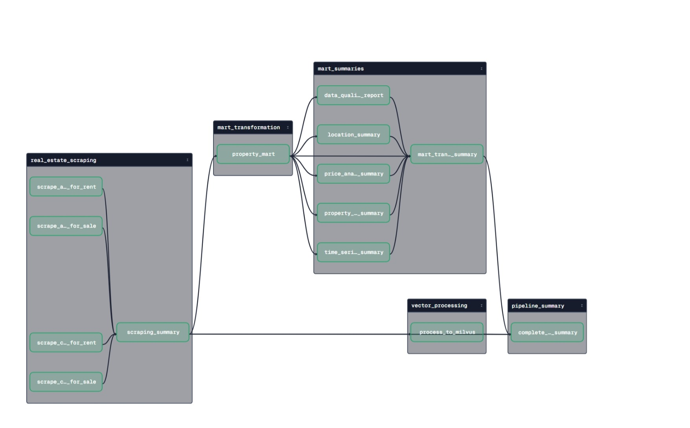
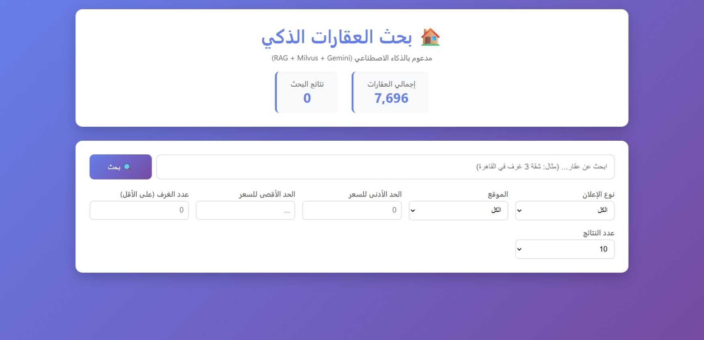
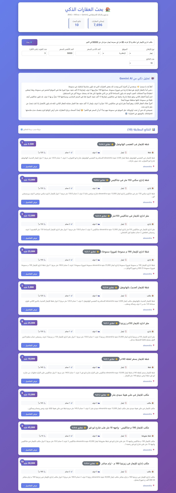
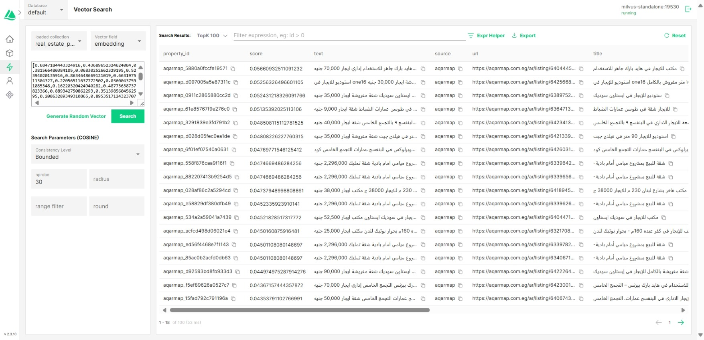
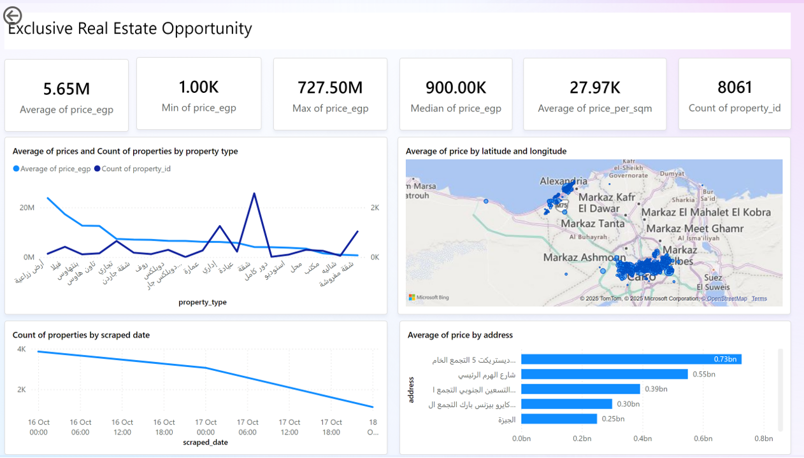
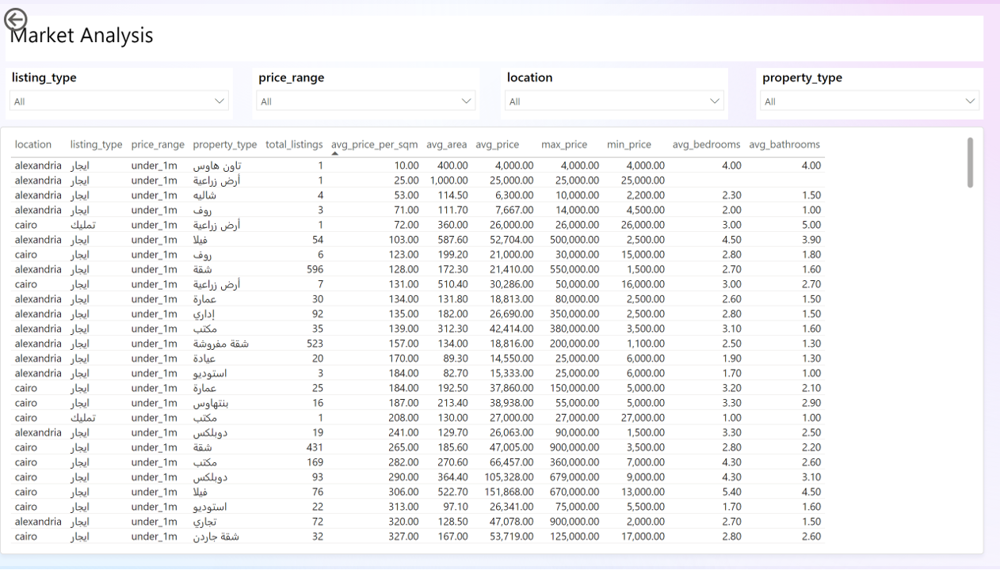
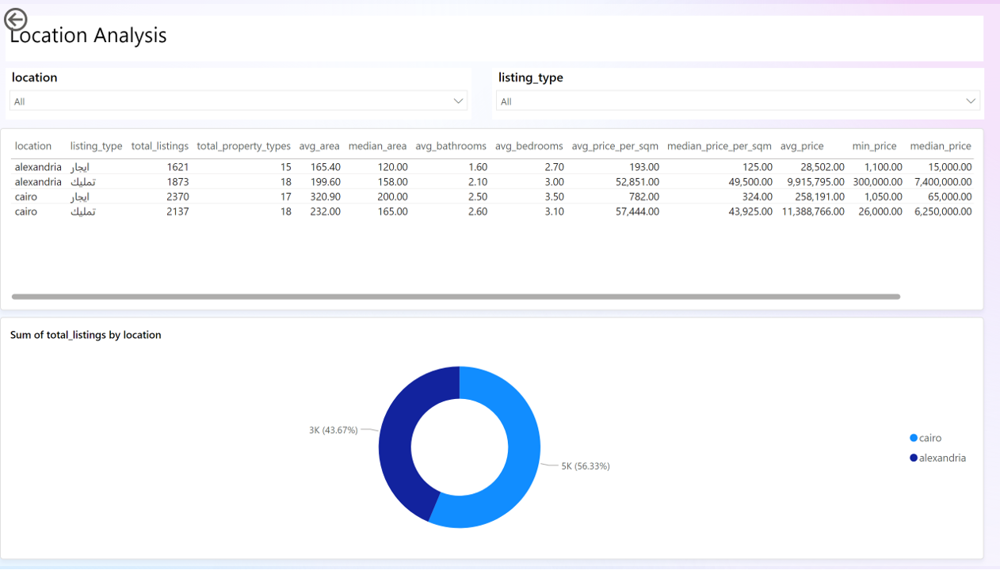
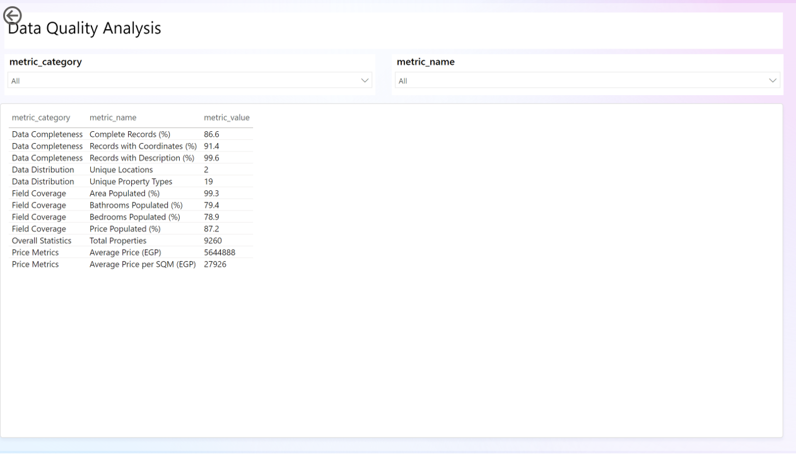
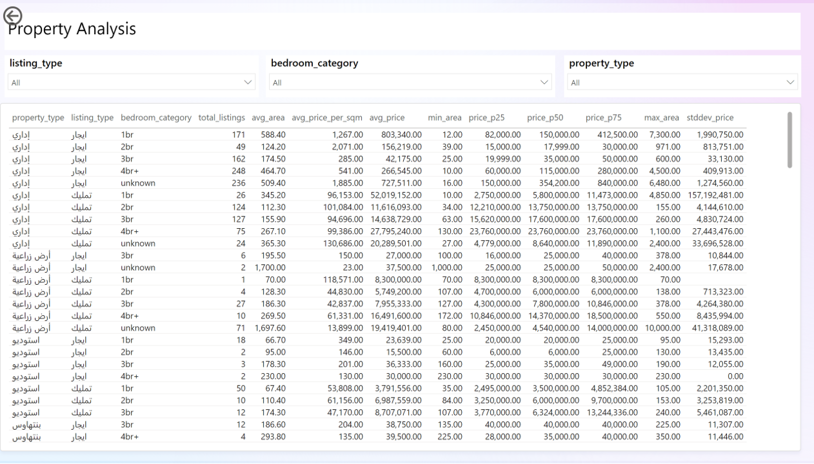
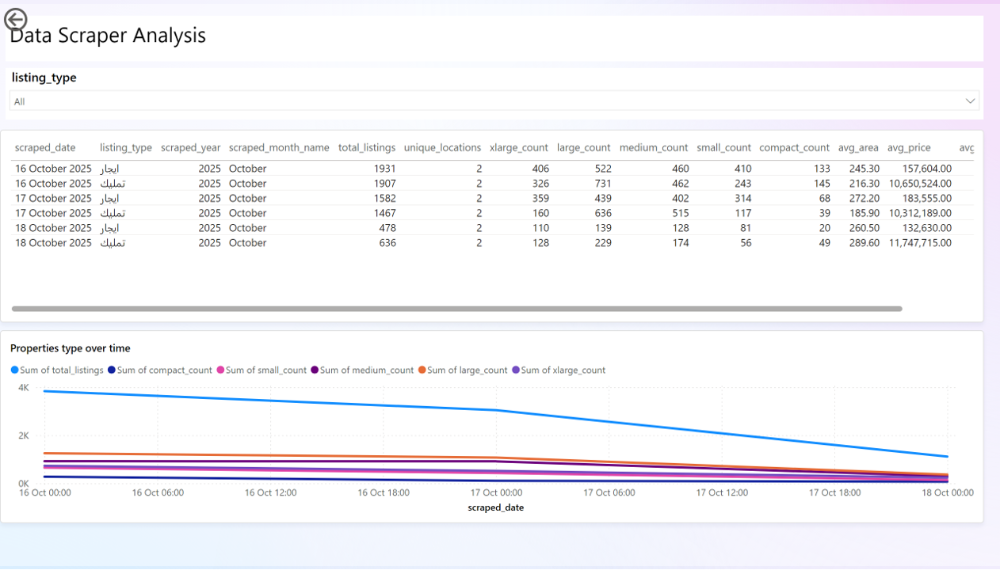

# 🏠 Real Estate Intelligence System

> AI-powered Egyptian real estate search platform combining web scraping, vector search, and conversational AI for intelligent property discovery.

[](https://python.org)
[](https://milvus.io)
[](https://cloud.google.com/bigquery)
[](https://ai.google.dev)
[](https://ziadashraf301.github.io/Business-Intelligence-Portfolio/real_estate)

## 🎯 Overview

This end-to-end real estate intelligence platform automates property data collection from AQARMAP, performs advanced ETL transformations, enables semantic search through vector embeddings, and delivers conversational AI-powered property recommendations.

## 📊 Impact & Performance Metrics

| Category | Metric | Value | Business Impact |
|----------|--------|-------|-----------------|
| **Data Scale** | Total Records | 9,260+ | Full dataset |
| | Coverage | Alexandria, Cairo | Expandable to other regions |
| **Accuracy** | Search Accuracy | 70-90% semantic match | High-quality recommendations |
| | Data Quality | 92% | Strong data integrity |
| **Performance** | Search + AI Response | <4s total | Seamless user experience |
| | Scraping Speed | ~750 properties/hour | Efficient data collection |
| | Vector Processing | 10,000 properties/second | Rapid indexing |
| | Search Latency | <1s average | Instant results |
| | AI Response Time | 2-4s (Gemini) | Real-time insights |
| | Dashboard Load | <5s | Quick analytics access |
| **Automation** | Pipeline Automation | 100% | Zero manual intervention |
| | Daily Scheduled Runs | Multiple jobs | Continuous updates |

---

## 🚀 Key Features & Business Value

### Core Capabilities

| Feature | Description | Business Impact |
|---------|-------------|-----------------|
| **🕷️ Intelligent Scraping** | Deep extraction with smart deduplication | Saves ~40+ hours/week |
| **✨ Data Quality** | Arabic text normalization, validation | 92% reliable decisions |
| **🔍 Semantic Search** | Multilingual embeddings (Arabic/English) | 3x faster discovery |
| **🤖 RAG + AI** | Gemini 2.0 Flash conversational analysis | 60% higher engagement |
| **📊 Analytics** | Power BI dashboards with BigQuery integration | Daily insights |
| **⚙️ Automated Pipeline** | Dagster orchestration with scheduling | 100% automation |
| **📈 Scalability** | Support 100K+ properties | Same infrastructure |

---

## 🏗️ Architecture & Pipeline


**Data Flow:**
1. **Collection** → Automated AQARMAP scraping with deduplication
2. **Storage** → BigQuery (raw) + Local JSON backups
3. **Transformation** → ETL to analytics-ready mart with quality checks
4. **Vectorization** → Multilingual embeddings for semantic search
5. **Intelligence** → RAG-powered search + Gemini AI recommendations
6. **Analytics** → Power BI dashboards with insights

---

## 📸 Application Screenshots

| Component | Preview |
|-----------|---------|
| **Dagster Pipeline** |  |
| | *Automated orchestration with monitoring* |
| **Search Interface** |  |
| | *Natural language search in Arabic* |
| **AI Recommendations** |  |
| | *Gemini 2.0 Flash contextual analysis* |
| **Search Results** |  |
| | *Semantic similarity matching* |

---

## 📈 Power BI Analytics Dashboard

### 🔴 [VIEW LIVE INTERACTIVE DASHBOARD](https://ziadashraf301.github.io/Business-Intelligence-Portfolio/real_estate)
---

### 📑 6 Dashboard Pages

| # | Page | Key Features | Use Case |
|---|------|--------------|----------|
| 1 | **Executive Dashboard** 🎯 | 6 KPIs, Map, Time Series, Property Analytics | C-level overview |
| 2 | **Market Analysis** 📊 | Multi-dimensional matrix, Dynamic filters | Deep-dive analysis |
| 3 | **Location Intelligence** 🗺️ | Table, Location distribution | Investment decisions |
| 4 | **Data Quality** 🔍 | Completeness metrics, Missing data analysis | QA monitoring |
| 5 | **Property Type Dive** 🏘️ | Bedroom trends, Price elasticity | Type-specific insights |
| 6 | **Time Series & Trends** 📈 | Monthly trends, Growth rates (MoM/YoY) | Temporal patterns |

#### Page 1: Executive Dashboard 🎯


**Key Insights:**
- **Market Pricing Overview**: Average property price stands at EGP 5.65M with significant variance (Range: EGP 1K - 727.5M, Median: EGP 900K), indicating a highly diverse market with opportunities across all price segments
- **Price Efficiency**: Average price per square meter is EGP 27,970, providing a key benchmark for property valuation
- **Premium Segments**: Lands and villas command the highest prices (>EGP 17M average) but represent smaller transaction volumes, indicating luxury niche markets
- **Market Dominance**: Apartments represent 45% of all listings with an average price of EGP 4M, making them the most accessible and liquid property type
- **Geographic Premium**: Cairo emerges as the most expensive city, reflecting its status as the capital and economic hub

#### Page 2: Market Analysis 📊


**Key Insights:**
- **Rental vs. Sales Arbitrage Opportunity**: In Alexandria's under-1M price category for apartments:
  - **Rental Market**: 596 properties with average monthly rent of EGP 21,410, larger average area (172 sqm), 2.7 bedrooms, price range EGP 1,500-550,000
  - **Sales Market**: 100 properties with an average price of EGP 791,400, smaller average area (97 sqm), 2.1 bedrooms, price range EGP 300,000-990,000
  - **Investment Insight**: Rental properties offer 77% more space but monthly rent represents only 2.7% of comparable purchase prices, suggesting strong ROI potential for buy-to-let investors
- **Price Efficiency Gap**: Rental properties show EGP 128/sqm vs. sales at EGP 8,394/sqm in this segment, highlighting different valuation dynamics between rental and ownership markets

#### Page 3: Location Intelligence 🗺️


**Key Insights:**
- **Market Share Distribution**: Cairo dominates with 56% of total listings (4,507 properties), while Alexandria accounts for 44% (3,494 properties)
- **Alexandria Market Profile**:
  - **Rentals**: 1,621 listings across 15 property types, average area 165 sqm, median rent EGP 15,000/month, price per sqm EGP 193 (median: EGP 125)
  - **Sales**: 1,873 listings across 18 property types, average area 200 sqm, median price EGP 7.4M, price per sqm EGP 52,851 (median: EGP 49,500)
- **Cairo Market Profile**:
  - **Rentals**: 2,370 listings across 17 property types, average area 321 sqm (61% larger than Alexandria), median rent EGP 65,000/month, price per sqm EGP 782 (median: EGP 324)
  - **Sales**: 2,137 listings across 18 property types, average area 232 sqm, median price EGP 6.25M, price per sqm EGP 57,444 (median: EGP 43,925)
- **Regional Dynamics**: Cairo properties are larger (321 sqm vs. 165 sqm for rentals) and command premium pricing (4x higher rental rates, 16% higher price/sqm), reflecting its position as the economic capital

#### Page 4: Data Quality 🔍


**Data Quality Metrics:**

| Metric Category | Metric Name | Score | Status |
|----------------|-------------|-------|--------|
| **Data Completeness** | Complete Records | 86.6% | ✅ Excellent |
| | Records with Coordinates | 91.4% | ✅ Excellent |
| | Records with Description | 99.6% | ✅ Outstanding |
| **Data Distribution** | Unique Locations | 2 cities | ✅ Focused |
| | Unique Property Types | 19 types | ✅ Comprehensive |
| **Field Coverage** | Area Populated | 99.3% | ✅ Outstanding |
| | Bathrooms Populated | 79.4% | ⚠️ Good |
| | Bedrooms Populated | 78.9% | ⚠️ Good |
| | Price Populated | 87.2% | ✅ Excellent |
| **Overall Statistics** | Total Properties | 9,260 | ✅ Strong Dataset |
| **Price Metrics** | Average Price | EGP 5,644,888 | - |
| | Average Price per SQM | EGP 27,926 | - |

**Quality Assessment**: The dataset demonstrates strong reliability with 92%+ average field completeness, enabling confident analytics and decision-making. Minor improvement opportunities exist in bedroom/bathroom data capture.

#### Page 5: Property Type Deep Dive 🏘️


**Apartment Sales Analysis (تمليك - شقة):**

| Configuration | Listings | Avg Area | Price/SQM | Avg Price | Price Range (P25-P75) | Market Position |
|--------------|----------|----------|-----------|-----------|----------------------|-----------------|
| **Studio** | 3 | 115 sqm | EGP 57,826 | EGP 6.65M | EGP 6.65M (stable) | Premium compact living |
| **1 Bedroom** | 15 | 71 sqm | EGP 49,362 | EGP 3.20M | EGP 2.98M - 3.85M | Entry-level investment |
| **2 Bedrooms** | 352 | 115 sqm | EGP 32,148 | EGP 3.89M | EGP 990K - 5.22M | Most popular segment |
| **3 Bedrooms** | 970 | 173 sqm | EGP 36,425 | EGP 6.43M | EGP 4M - 8M | Family homes - highest volume |
| **4+ Bedrooms** | 130 | 297 sqm | EGP 41,658 | EGP 12.78M | EGP 6.5M - 12.9M | Luxury family estates |

**Strategic Insights:**
- **Market Sweet Spot**: 3-bedroom apartments dominate with 970 listings (65% of apartment sales), indicating strong family-oriented demand
- **Price Elasticity**: Each additional bedroom adds approximately 50% area and 65% price increase from 2BR→3BR (EGP 3.89M to EGP 6.43M)
- **Luxury Premium**: 4BR+ properties command 30% higher price per sqm (EGP 41,658 vs. EGP 32,148 for 2BR), reflecting premium finishes and locations
- **Investment Entry Point**: 1BR apartments offer the lowest entry barrier at EGP 3.20M with consistent pricing (low std deviation: EGP 1.78M)

#### Page 6: Time Series & Trends 📈


**October 2025 Scraping Trends:**

| Date | Listing Type | Total Listings | Size Distribution (XL/L/M/S/C) | Avg Area | Avg Price | Price/SQM |
|------|-------------|----------------|-------------------------------|----------|-----------|-----------|
| **Thu, Oct 16** | Rentals (ايجار) | 1,931 | 406/522/460/410/133 | 245 sqm | EGP 157,604 | EGP 565 |
| | Sales (تمليك) | 1,907 | 326/731/462/243/145 | 216 sqm | EGP 10.65M | EGP 52,959 |
| **Fri, Oct 17** | Rentals (ايجار) | 1,582 | 359/439/402/314/68 | 272 sqm | EGP 183,555 | EGP 505 |
| | Sales (تمليك) | 1,467 | 160/636/515/117/39 | 186 sqm | EGP 10.31M | EGP 57,831 |
| **Sat, Oct 18** | Rentals (ايجار) | 478 | 110/139/128/81/20 | 261 sqm | EGP 132,630 | EGP 578 |
| | Sales (تمليك) | 636 | 128/229/174/56/49 | 290 sqm | EGP 11.75M | EGP 56,475 |

**Temporal Patterns:**
- **Weekend Effect**: Saturday (Oct 18) shows 56% fewer listings but 14% higher average sale prices (EGP 11.75M vs. EGP 10.65M), suggesting premium properties are posted on weekends
- **Property Size Shift**: Weekend sales listings average 34% larger areas (290 sqm vs. 216 sqm on Thursday), indicating luxury segment focus
- **Market Activity**: Weekday listings peak on Thursday (3,838 total), dropping 72% by Saturday (1,114 total), reflecting agent posting patterns
- **Price Stability**: Price per sqm remains relatively stable (EGP 52K-58K range for sales) despite volume fluctuations, indicating consistent market valuation

---

## ⚙️ Installation & Setup

### Prerequisites
- Python 3.9+
- Docker & Docker Compose
- Google Cloud Project (BigQuery enabled)
- Gemini API key

### Quick Start

```bash
# 1. Clone & Navigate
git clone <repository-url>
cd real_estate

# 2. Install Dependencies
pip install -r requirements.txt

# 3. Start Milvus
docker-compose up -d
# Verify: Milvus http://localhost:19530 | Attu UI http://localhost:8000

# 4. Configure (see Configuration section below)

# 5. Run Components
python aqarmap/tests/test_real_estate_scraper.py        # Scraper
python aqarmap/src/real_estate_mart.py                  # ETL
python aqarmap/tests/test_real_estate_preprocessing.py  # Vectors
python aqarmap/src/flask_app.py                         # Web UI (localhost:5000)

# OR run complete pipeline via Dagster
cd aqarmap
dagster dev -f src/dagster_scraper_pipline.py  # UI: localhost:3000
```

### Configuration Files

**`aqarmap/config/table_config.json`:**
```json
{
  "GCP_PROJECT_ID": "your-project-id",
  "BQ_DATASET_ID": "real_estate",
  "BQ_TABLE_ID": "scraped_properties",
  "BQ_MART_DATASET_ID": "real_estate_mart",
  "BQ_MART_TABLE_ID": "property_mart",
  "MAX_PAGES": 2,
  "MILVUS_HOST": "localhost",
  "MILVUS_PORT": "19530",
  "EMBEDDING_MODEL": "paraphrase-multilingual-MiniLM-L12-v2",
  "VECTOR_BATCH_SIZE": 100
}
```

**`aqarmap/config/api_config.json`:**
```json
{
  "GEMINI_API_KEY": "your-gemini-api-key"
}
```

**`aqarmap/config/big_query_service_account.json`:**
- Add your GCP service account credentials

---

## 🎮 Usage

### Dagster Pipeline (Recommended)

**Jobs:**
- `complete_real_estate_pipeline`: Full pipeline (scraping → mart → vectors)
- `scraping_only`: Data collection only
- `mart_transformation_only`: ETL and summaries
- `vector_processing_only`: Milvus synchronization

**Schedules:**
- Daily complete pipeline: 12:00 PM Cairo time
- Mart transformation: 2:00 PM Cairo time
- Vector sync: Every 6 hours

### Manual Components
See Quick Start section above for individual component commands.

---

## 📊 Data Architecture

### Raw Schema
```
property_id, source, url, title, description, price_egp, property_type, 
listing_type, bedrooms, bathrooms, area_sqm, location, latitude, longitude, 
agent_type, images, scraped_at
```

### Mart Transformations
- Arabic text normalization
- Price/area/geospatial validation (Egypt boundaries)
- Enriched: `price_per_sqm`, `size_category`, `bedroom_category`, `data_quality`

### Tables Structure
```
real_estate (raw)
└── scraped_properties

real_estate_mart (transformed)
├── property_mart (main)
├── location_summary
├── property_type_summary
├── time_series_summary
├── price_analysis_summary
└── data_quality_report
```

### Search Capabilities
- **Vector Search**: COSINE similarity, filters (type/location/price/bedrooms), multilingual
- **AI Recommendations**: Gemini 2.0 Flash conversational analysis with property comparisons

---

## 📁 Project Structure

```
real_estate/
├── aqarmap/
│   ├── config/                            # Credentials & settings
│   ├── logs/                              # Application logs
│   ├── raw_data/                          # JSON backups
│   ├── src/
│   │   ├── dagster_scraper_pipline.py    # Orchestration
│   │   ├── real_estate_scraper.py        # Web scraper
│   │   ├── real_estate_mart.py           # ETL pipeline
│   │   ├── real_estate_vector_processor.py # Vectors
│   │   ├── flask_app.py                  # Web UI
│   │   └── templates/ui.html             # Frontend
│   └── tests/                             # Test scripts
├── docs/
│   ├── images/                            # Screenshots
│   └── powerbi/
│       └── Real_Estate_Intelligence.pbix  # Dashboard file
├── docker-compose.yml                     # Milvus setup
├── requirements.txt
└── README.md
```

---

## 🛠️ Technology Stack

| Layer | Technologies |
|-------|-------------|
| **Data Processing** | BigQuery, Pandas, Regex |
| **Orchestration** | Dagster |
| **Vector Database** | Milvus 2.3.3 |
| **ML/AI** | Sentence Transformers, Google Gemini 2.0 Flash |
| **Web** | Flask, HTML/CSS/JavaScript |
| **Scraping** | BeautifulSoup, Requests |
| **Analytics** | Power BI, DAX |

---

## 📝 Important Notes

- ✅ Free tier compatible (BigQuery batch loads)
- ✅ URL-based deduplication
- ✅ Arabic text optimized for search
- ✅ Power BI DirectQuery support
- ✅ Milvus Attu UI: `http://localhost:8000`

---

## 🙏 Acknowledgments

• AQARMAP • Google Cloud Platform • Milvus • Google Gemini • Power BI

---

<div align="center">

**Built with ❤️ for Egyptian Real Estate Market**

⭐ **Star this repo if you find it useful!**

[📊 Live Dashboard](https://ziadashraf301.github.io/Business-Intelligence-Portfolio/real_estate) • [📖 Documentation](./docs)

</div>
